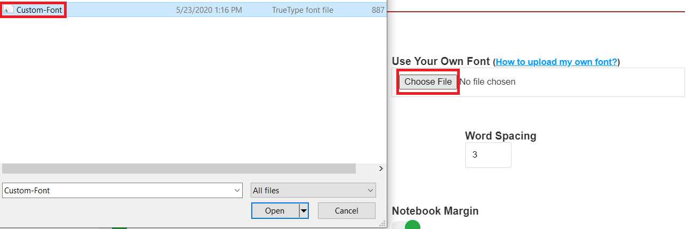
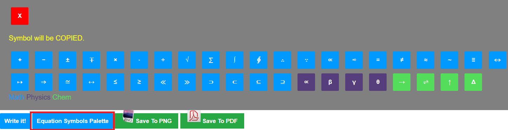

# Handwritten Sheet Generator

Easily convert your Text To Handwriting Online (Free!)

Huh another ASSIGNMENT??? Mood off? I too cringe for these assignments so here you go!!

If that sounds like you, this is for you!

A new, simple way of "writing" assignments and "scanning" them to your teacher (aka typing your notes and getting this natural, handwriting-like image which looks like a scanned copy".

Feel free to join me @ GitHub and fix the bugs, add enhancements, and serve a rather important section of the world's population: the students!

Created with for students, by a student.

## Snapshot

## Features
### 1️⃣ Wide Array Of Fonts To Choose From

### 2️⃣ Supports Uploading Custom Fonts

### 3️⃣ Multiple Pen Ink Colors

### 4️⃣ Advanced Document Customization

### 5️⃣ Download As Image OR PDF!

### 6️⃣ Copy And Paste Equation Symbols Without Leaving The Tab!

### 7️⃣ Dedicated Info Button
 => 
